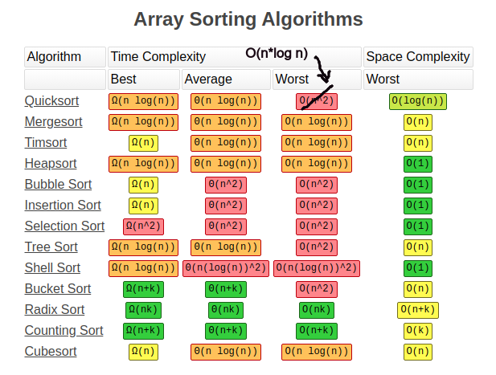
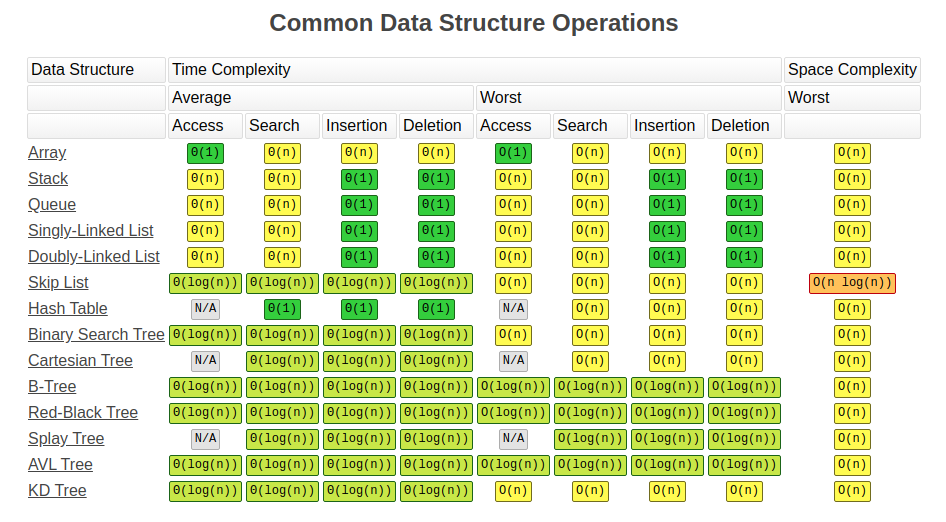

# Algorithm Runtime Analysis

**What is Algorithm Runtime Analysis?**\
It is a study of a given algorithms's running time, by identifying its behavior as the input size for the algorithm increases. In a layman's language we can say "how much time will the given algorithm will take to run"

**Notations:**
  - There are 3 notations for Runtime Analysis:
    * Omega: This notation gives the tighter lower bound of a given algorithm. In other words, running time will not be less than Omega. 
    * Big-o: This notation gives the tighter upper bound of a given algorithm. In other words, running time will not be more than Omega.
    * Theta: This notation gives the average running time of an algorithm. 

Examples of Runtime Complexity:
  * Constant - O(1) - Adding an element to the front of a linked list
  * Logarithmic - O(log n) - Finding an element in a sorted array
  * Linear - O(n) - Finding an element in an unsorted array
  * Linear Logarithmic - O(n*log n) - Merge Sort
  * Quadratic - O(n^2) - Shortest path b/w 2 nodes in a graph
  * Cubic - O(n^3) - Matrix Multiplication
  * Exponential - O(2^n) - Tower of Hanoi problem
  * Factorial - O(n!)

Some graphs to help memorizing different operations

