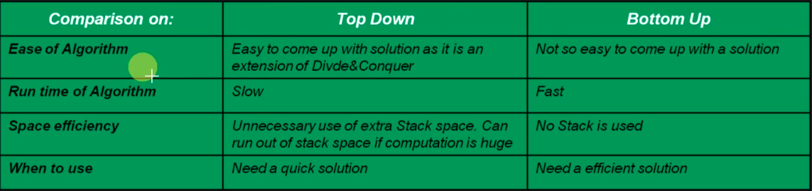

# Dynamic Programming

DP is a method for solving a complex for solving a complex problem by breaking it down into a collection of simpler subproblems, solving each of those subproblems just once and store their solutions. The next time the same subproblem occurs, instead of recomputing its solution, one simply looks up the previously computed solution, thereby saving computation time at the expense of a modest expenditure in storage space. 

DP is mainly an improvement over plain "Divide and Conquer"

Properties of DP:
  - Optimal Substructure: if the overall optimal solution can be constructed from the optimal solution of its subproblems
  - Overlapping subproblem: if finding the solution involves solving the same subproblem multiple times

**Approaches of solving DP problem:**
  - Top-Down Approach (Memoization):
    * In this approach, the problem is first broken into smaller subproblems
    * Then, these subproblems are solved, and the solution to these subproblems are remembered (to reuse the solution, in case same subproblem needs to be solved again)
  - Bottom-Up Approach (Tabulation):
    * In this approach, we evaluate the function starting with smallest possible input argument value and then we slowly increase the input argument value.
    * While computing the values we store all the computed values in memory (table)
    * As larger arguments are evaluated, precomputed values for smaller arguments can be reused. 
    * In this case, all the subproblems that we might need in future are precomputed and then they are used to solve bigger probem. 

**Top Down vs. Bottom Up Approach**

The two approaches are compared below:

**Some Notes**
  - In DP, you must store the result of each iteration to reuse it in other iterations
  - At the beginning of each iteration in DP, we must check whether there is already an answer for that iteration, if so, then we can return that answer and skip the iteration.
  - One way to see if a 'divide and conquer' approach has a DP solution is to draw the recursion tree and see if any node on that tree is repeated somewhere else. 
  - Top-down approach is just a slight improvement over divide and conquer (by storing the result of each iteration) and basically everything else is the same. 
  - Bottom-up is very fast compared to top-down. However, it is not easy to see how a problem can be saved in a bottom-up way. So, it is recommended to start with 'divide and conquer' approach, then improve it by 'top-down' approach, if possible, and then reverse-engineer the top-down approach to find the bottom-up solution. 

