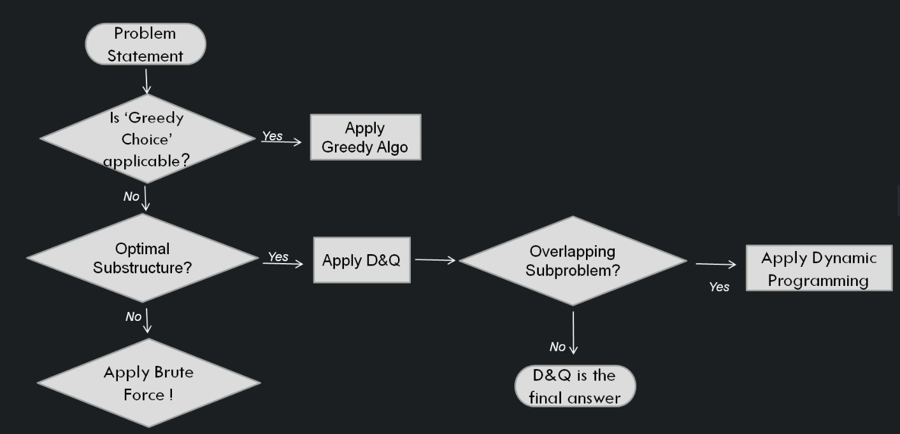

# Magic Framework

In interview, if you know the solution, then everything is fine. But if it is a new problem and you are not sure how to solve it, then you can follow a flowchart (magic framework) to determine which algorithm technique works better for the problem statement. The framework picture is illustrated below: 

