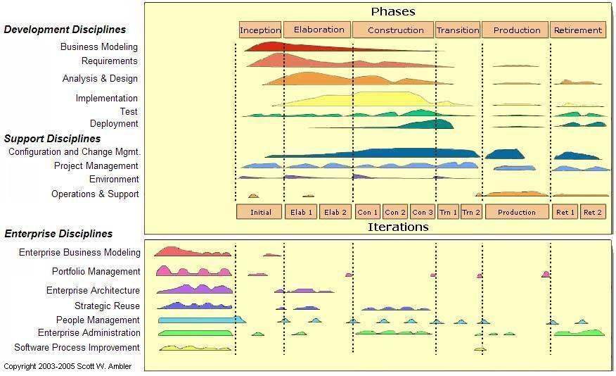
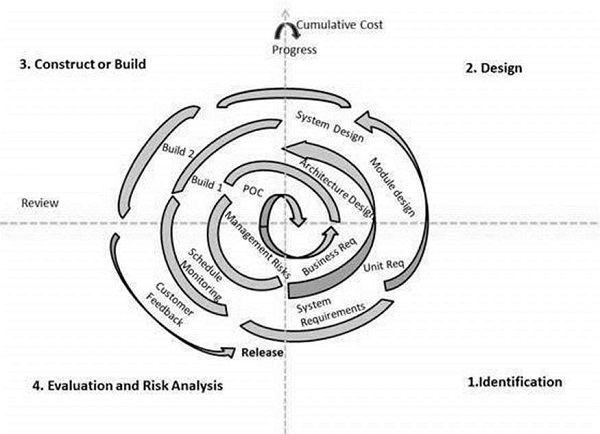

## Software Development Models

Models:
  * Waterfall Model: 
    * It is also called linear (predictive) model. 
    * The Waterfall model is the earliest SDLC approach that was used for software development.
    * It is very simple to understand and use. 
    * In a waterfall model, each phase must be completed before the next phase can begin and there is no overlapping in the phases
  * V-Model:
    * process executes in a sequential manner in V-shape.
    * It is also known as Verification and Validation model.
    * It is based on the association of a testing phase for each corresponding development stage. Development of each step directly associated with the testing phase. 
    * The next phase starts only after completion of the previous phase i.e. for each development activity, there is a testing activity corresponding to it.
  * Sashimi Model: 
    * quite similar to the waterfall, except that the phases overlap to show that requirements can't be completed until architecture is at least partially explored, and architecture can't be completed until module design is at least partially explored, and so on.

The sashimi process is most appropriate for medium-sized projects for which the communication between phases can be handled in an improvised manner. For larger projects, high-risk projects, or projects in which few of the developers are experienced, a spiral approach may be better.
  * Iterative Model:
    * Iterative process starts with a simple implementation of a small set of the software requirements and iteratively enhances the evolving versions until the complete system is implemented and ready to be deployed.
    * An iterative life cycle model does not attempt to start with a full specification of requirements. Instead, development begins by specifying and implementing just part of the software, which is then reviewed to identify further requirements. This process is then repeated, producing a new version of the software at the end of each iteration of the model.
  * Incremental Model: 
    * Incremental Model is a process of software development where requirements are broken down into multiple standalone modules of software development cycle.
    * Incremental development is done in steps from analysis design, implementation, testing/verification, maintenance. 
    * Each iteration passes through the requirements, design, coding and testing phases. And each subsequent release of the system adds function to the previous release until all designed functionality has been implemented.
  * Unified Process Model:
  * Spiral Model:
    * This Spiral model is a combination of iterative development process model and sequential linear development model i.e. the waterfall model with a very high emphasis on risk analysis. It allows incremental releases of the product or incremental refinement through each iteration around the spiral.

## Waterfall Model 

**Waterfall Model - Application**
Some situations where the use of Waterfall model is most appropriate are:
  * Requirements are very well documented, clear and fixed.
  * Product definition is stable.
  * Technology is understood and is not dynamic.
  * There are no ambiguous requirements.
  * Ample resources with required expertise are available to support the product.
  * The project is short.

**Waterfall Model - Advantages**
The advantages of waterfall development are that it allows for departmentalization and control. A schedule can be set with deadlines.

Some of the major advantages of the Waterfall Model are as follows:
  * Simple and easy to understand and use
  * Easy to manage due to the rigidity of the model. Each phase has specific deliverables and a review process.
  * Phases are processed and completed one at a time.
  * Works well for smaller projects where requirements are very well understood.
  * Clearly defined stages.
  * Well understood milestones.
  * Easy to arrange tasks.
  * Process and results are well documented.

**Waterfall Model - Disadvantages**
The disadvantage of waterfall development is that it does not allow much reflection or revision. Once an application is in the testing stage, it is very difficult to go back and change something that was not well-documented or thought upon in the concept stage.

The major disadvantages of the Waterfall Model are as follows:
  * No working software is produced until late during the life cycle.
  * High amounts of risk and uncertainty.
  * Not a good model for complex and object-oriented projects.
  * Poor model for long and ongoing projects.
  * Not suitable for the projects where requirements are at a moderate to high risk of changing. So, risk and uncertainty is high with this process model.
  * It is difficult to measure progress within stages.
  * Cannot accommodate changing requirements.
  * Adjusting scope during the life cycle can end a project.
  * Integration is done as a "big-bang. at the very end, which doesn't allow identifying any technological or business bottleneck or challenges early.

## References

Waterfall Model:
  * https://www.tutorialspoint.com/sdlc/sdlc_waterfall_model.htm
  * https://www.geeksforgeeks.org/software-engineering-classical-waterfall-model/

V-Model:
  * https://www.tutorialspoint.com/sdlc/sdlc_v_model.htm
  * https://www.geeksforgeeks.org/software-engineering-sdlc-v-model/

Iterative Model:
  * https://www.tutorialspoint.com/sdlc/sdlc_iterative_model.htm

Incremental Model:
  * https://www.guru99.com/what-is-incremental-model-in-sdlc-advantages-disadvantages.html

Unified Process Model:
  * http://agilemodeling.com/essays/agileModelingRUP.htm

Spiral Model:
  * https://www.tutorialspoint.com/sdlc/sdlc_spiral_model.htm

